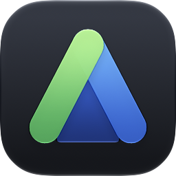
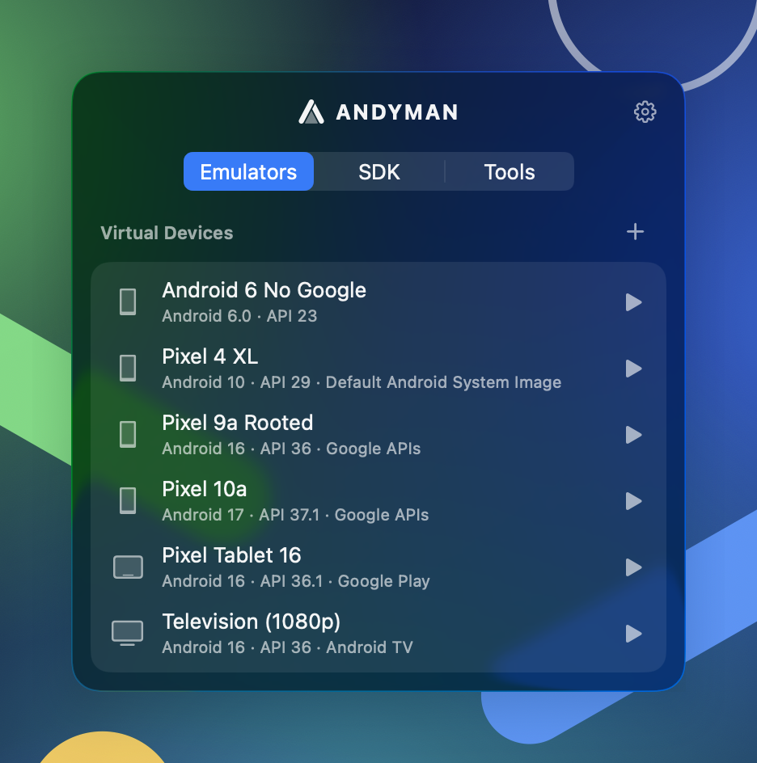
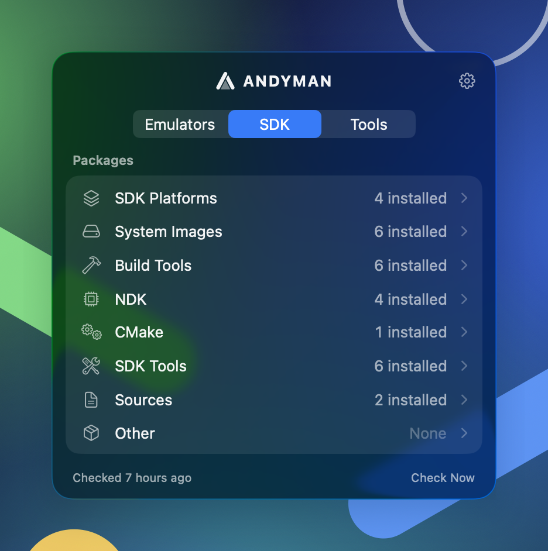
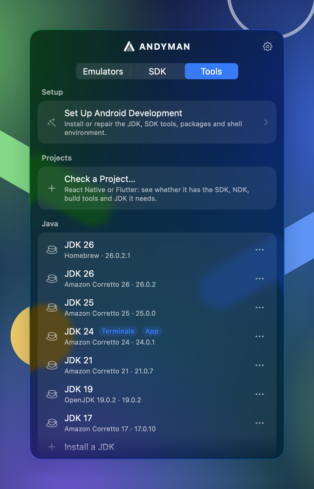

<p align="center">
  
</p>

<h1 align="center">Andyman</h1>

<p align="center">
  A handyman for your Android setup: emulators, SDK packages, JDKs and project checks,<br>
  from the Mac menu bar, without opening Android Studio.
</p>

<p align="center">
  
  
  
</p>

Andyman is for React Native and Flutter developers who need Android's toolchain but not its IDE.
It lives in the menu bar, and everything it does is also available to scripts and coding agents
through the `andyman` command-line tool.

## Features

**Emulators**
- Start, stop, cold boot, wipe and delete virtual devices; see which are running from the menu bar icon.
- Create devices from any hardware profile and system image (downloading the image if needed), and edit memory, storage, cores, orientation, frame and keyboard.
- Duplicate, rename, manage snapshots, and repair broken or orphaned AVDs.
- For running emulators: open React Native's dev menu, reload, forward the Metro port, take a screenshot, or drag an `.apk` onto the row to install it.

**SDK packages**
- Browse platforms, system images, build tools, NDKs, CMake, platform tools, the emulator and command-line tools, on the stable, beta, dev or canary channel.
- Install, update and remove with a shared download queue that keeps going when the panel closes; review licenses before accepting them.

**Setup from scratch**
- On a Mac with nothing installed: downloads a JDK and the command-line tools, installs what React Native or Flutter needs (following their latest releases), creates a first emulator and sets `ANDROID_HOME`, `JAVA_HOME` and `PATH` in your shell profile.

**Tools**
- **Project doctor:** point it at a React Native or Flutter project to see whether the SDK platform, build tools, NDK, CMake and JDK it needs are installed, the way Gradle resolves them, with one-click fixes.
- **Java:** every JDK on your Mac, which one terminals and the app use, and Temurin installs.
- **Free up space:** Gradle caches and old distributions, emulator snapshots, Metro caches and SDK leftovers, with sizes. Stop idle Gradle and Kotlin daemons.

**For coding agents**
- The `andyman` CLI does everything the app does, with `--json` output, stable exit codes and no prompts.
- A generated agent skill teaches Claude Code, Codex, Gemini CLI, Cursor, Copilot and OpenCode to use it; install it from the app or with `andyman skill install`.

## Command line

```bash
andyman doctor                     # SDK, JDK and shell environment
andyman avd list                   # virtual devices
andyman emulator start Pixel_9 --wait-boot
andyman sdk install "platforms;android-36"
andyman project check ~/code/my-app --fix
andyman cleanup list
```

Every command accepts `--json`, never prompts, and needs `--yes` for anything destructive.
Run `andyman help <command>` for details. The app can link `andyman` into `~/.local/bin`
(Settings → Command-Line Tool & Agent Skill).

## Requirements

- macOS 26 or later.
- An Android SDK is optional: Andyman uses an existing one (`ANDROID_HOME`, or Android Studio's in `~/Library/Android/sdk`) or sets one up.

## Building from source

Open `Andyman.xcodeproj` in Xcode 26 or later and run the **Andyman** scheme; it builds and
embeds the `andyman` CLI. The core library has its own tests:

```bash
swift test --package-path AndroidKit
```

## License

MIT. See [LICENSE](LICENSE).

Android is a trademark of Google LLC. Andyman is not affiliated with or endorsed by Google.
